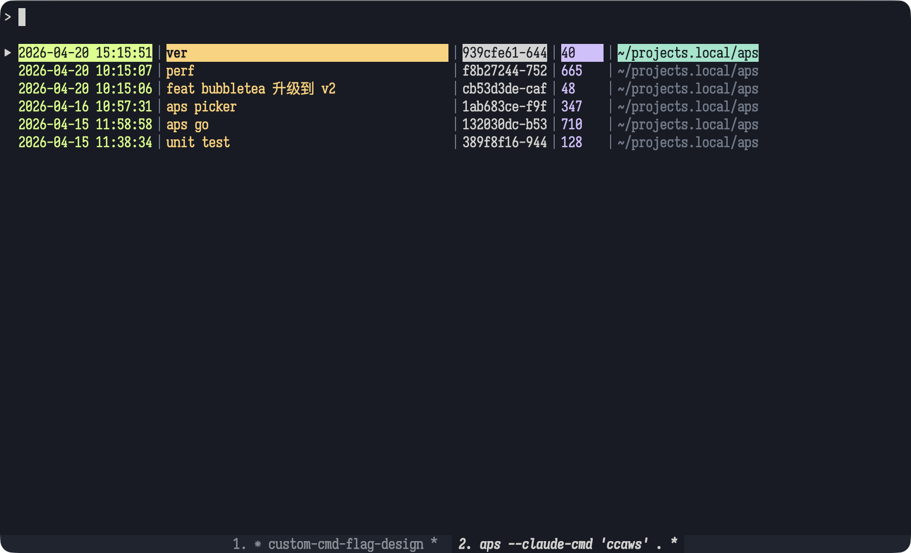
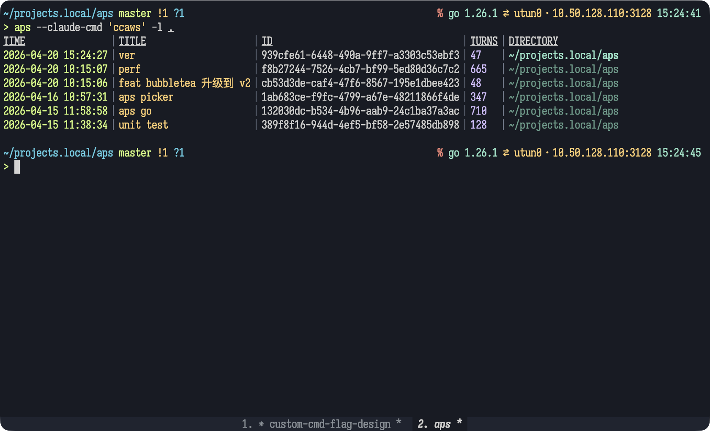

# aps — Agent Pick Session

[](https://github.com/gadflysu/aps/actions/workflows/ci.yml)
[](https://codecov.io/gh/gadflysu/aps)
[](https://goreportcard.com/report/github.com/gadflysu/aps)
[](LICENSE)

AI coding agents accumulate dozens of sessions across many projects. `aps` cuts through the noise: fuzzy-match by title, directory, or session ID, preview recent messages and the working tree side-by-side, then press `Enter` to resume exactly where you left off. Pure Go TUI — no daemon, no config.

## Screenshots

**Interactive mode** — fuzzy search with three-pane preview



**List mode** — scriptable table output



## Install

**Homebrew** (macOS / Linux):

```bash
brew install gadflysu/tap/aps
```

**Go install**:

```bash
go install github.com/gadflysu/aps@latest
```

**GitHub Releases**: download a pre-built binary from the [Releases page](https://github.com/gadflysu/aps/releases).

**Build from source**:

```bash
git clone https://github.com/gadflysu/aps.git
cd aps
go install .
```

## Usage

```bash
aps                   # Interactive picker (Claude sessions, cwd filter)
aps -l .              # List mode, filter by current directory
aps -l scripts        # List mode, substring filter
aps -r -l foo         # Recursive: looser substring match
aps -c                # Claude Code only
aps -o                # Opencode only
aps -a                # Both clients combined
aps -n                # No-launch: print target directory
aps -nv               # No-launch verbose: print full launch command
aps -d                # Danger mode (--dangerously-skip-permissions)
aps --claude-cmd ccaws   # Override Claude Code binary (supports shell aliases)
aps --opencode-cmd oc    # Override Opencode binary
```

### Interactive mode keys

| Key | Action |
|-----|--------|
| Type | Fuzzy filter by title, directory, ID, or time |
| `↑` / `↓` or `k` / `j` | Move cursor |
| `Space` | Toggle three-pane preview |
| `Tab` | Cycle preview focus (RECENT MESSAGES ↔ DIRECTORY) |
| `j` / `k` | Scroll focused preview pane |
| `Enter` | Launch session |
| `Esc` / `q` / `Ctrl+C` | Quit |

## Dependencies

| Package | Purpose |
|---------|---------|
| [charmbracelet/bubbletea](https://github.com/charmbracelet/bubbletea) | TUI framework |
| [charmbracelet/bubbles](https://github.com/charmbracelet/bubbles) | Text input and scrollable viewport components |
| [charmbracelet/lipgloss](https://github.com/charmbracelet/lipgloss) | Terminal styling |
| [charmbracelet/x/term](https://github.com/charmbracelet/x) | TTY detection and terminal width query |
| [sahilm/fuzzy](https://github.com/sahilm/fuzzy) | Fuzzy matching |
| [modernc.org/sqlite](https://gitlab.com/cznic/sqlite) | Pure-Go SQLite driver (no cgo) |

## Data Sources

| Client | Location | Format |
|--------|----------|--------|
| Claude Code | `~/.claude/projects/*/*.jsonl` | JSONL |
| Opencode | `~/.local/share/opencode/opencode.db` | SQLite |

Default client is Claude Code. Use `-o` / `-a` to include Opencode.

## Contributing

Bug reports and pull requests are welcome. See [CONTRIBUTING.md](CONTRIBUTING.md) for the full workflow. Please open an issue first to discuss any significant change before submitting a PR.

## License

MIT © [gadflysu](https://github.com/gadflysu)
