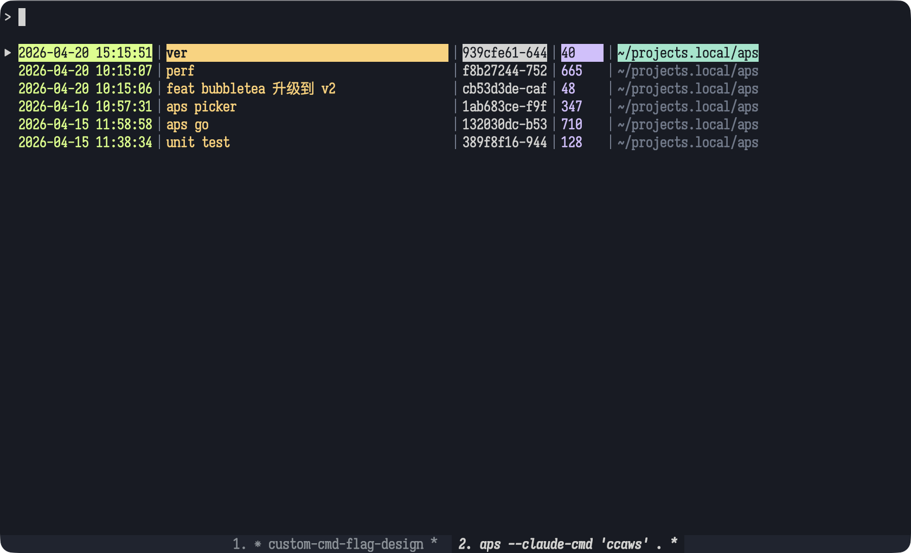
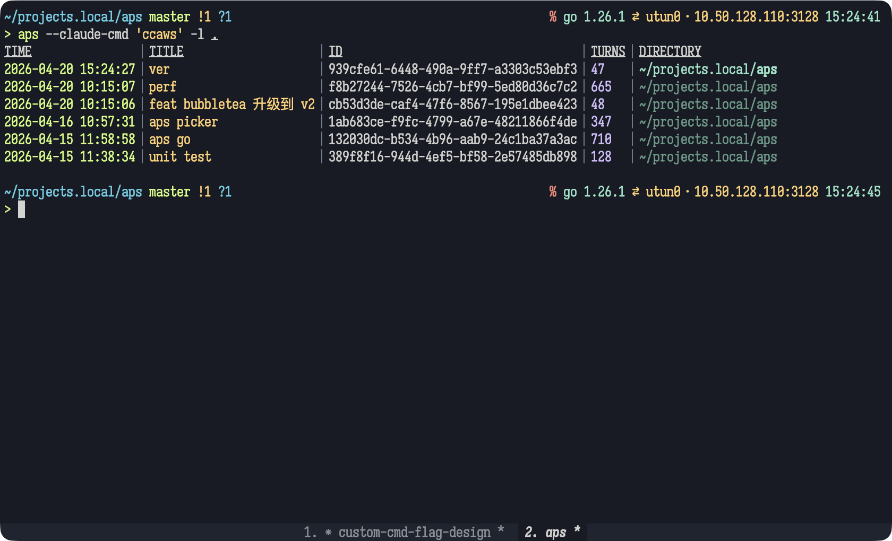

# aps — Agent Pick Session

[](https://github.com/gadflysu/aps/actions/workflows/ci.yml)
[](https://codecov.io/gh/gadflysu/aps)
[](https://goreportcard.com/report/github.com/gadflysu/aps)
[](https://github.com/gadflysu/aps/releases/latest)
[](https://pkg.go.dev/github.com/gadflysu/aps)
[](https://go.dev/doc/install)
[](LICENSE)

AI coding agents accumulate dozens of sessions across many projects. `aps` cuts through the noise: fuzzy-match by title, directory, or session ID, preview recent messages and the working tree side-by-side, then press `Enter` to resume exactly where you left off. Sessions stream into the picker as they are parsed — no waiting for the full load to complete. Pure Go TUI — no daemon, no config.

## Screenshots

**Interactive mode** — fuzzy search with three-pane preview



**List mode** — scriptable table output



## Install

**Homebrew** (macOS / Linux):

```bash
brew install gadflysu/tap/aps
```

**Go tools**:

```bash
go install github.com/gadflysu/aps@latest   # latest release
go install github.com/gadflysu/aps@master   # build from master source
```

**GitHub Releases**: download a pre-built binary from the [Releases page](https://github.com/gadflysu/aps/releases).

**Build from source**:

```bash
git clone https://github.com/gadflysu/aps.git
cd aps
go install .
```

## Usage

```bash
aps                   # Interactive picker (all agents, cwd filter)
aps -l .              # List mode, filter by current directory
aps -l scripts        # List mode, substring filter
aps -r -l foo         # Recursive: looser substring match
aps -c                # Claude Code only
aps -o                # Opencode only
aps -x                # Codex only
aps -a                # All clients combined
aps -n                # No-launch: print target directory
aps -nv               # No-launch verbose: print full launch command
aps -c --claude-cmd ccaws   # Override Claude Code binary (alias; requires shell-init)
aps -o --opencode-cmd oc    # Override Opencode binary (alias; requires shell-init)
aps -c --claude-cmd ./ccaws-wrapper   # Override with wrapper script (no shell-init needed)
aps --debug-log /tmp/aps.log   # Write debug log to file
```

### Shell integration (alias/function custom commands)

By default, `--claude-cmd`, `--opencode-cmd`, `--codex-cmd`, and `--cmd` accept external binaries or scripts only. Shell aliases and functions are not available because aps launches commands in a subprocess.

To use shell aliases or functions as custom commands, install the shell integration:

```bash
# Try in current shell (zsh)
eval "$(aps shell-init zsh)"

# Try in current shell (bash)
eval "$(aps shell-init bash)"

# Add permanently (zsh)
echo 'eval "$(aps shell-init zsh)"' >> ~/.zshrc

# Add permanently (bash)
echo 'eval "$(aps shell-init bash)"' >> ~/.bashrc
```

The shell integration wraps `aps` so that custom commands are evaluated in your current shell, where aliases and functions are available. It does not modify any rc files automatically.

### Interactive mode keys

| Key | Action |
|-----|--------|
| Type | Fuzzy filter by title, directory, ID, or time |
| `↑` / `↓` or `k` / `j` | Move cursor |
| `Space` | Toggle three-pane preview |
| `Tab` | Cycle preview focus (RECENT MESSAGES ↔ DIRECTORY) |
| `j` / `k` | Scroll focused preview pane |
| `Enter` | Launch session |
| `Esc` / `q` / `Ctrl+C` | Quit |

## Dependencies

| Package | Purpose |
|---------|---------|
| [charmbracelet/bubbletea](https://github.com/charmbracelet/bubbletea) | TUI framework |
| [charmbracelet/bubbles](https://github.com/charmbracelet/bubbles) | Text input and scrollable viewport components |
| [charm.land/lipgloss/v2](https://charm.land/lipgloss) | Terminal styling |
| [charmbracelet/x/term](https://github.com/charmbracelet/x) | TTY detection and terminal width query |
| [fsnotify/fsnotify](https://github.com/fsnotify/fsnotify) | Cross-platform filesystem event watcher |
| [sahilm/fuzzy](https://github.com/sahilm/fuzzy) | Fuzzy matching |
| [modernc.org/sqlite](https://gitlab.com/cznic/sqlite) | Pure-Go SQLite driver (no cgo) |

## Data Sources

| Agent | Location | Format |
|--------|----------|--------|
| Claude Code | `~/.claude/projects/*/*.jsonl` | JSONL |
| Opencode | `~/.local/share/opencode/opencode.db` | SQLite |
| Codex | `~/.codex/` | SQLite + JSON |

Default agent selection includes all three agents. Use `-c`, `-o`, or `-x` to restrict the picker to one agent.

## Contributing

Bug reports and pull requests are welcome. See [CONTRIBUTING.md](CONTRIBUTING.md) for the full workflow. Please open an issue first to discuss any significant change before submitting a PR.

## License

MIT © [gadflysu](https://github.com/gadflysu)
